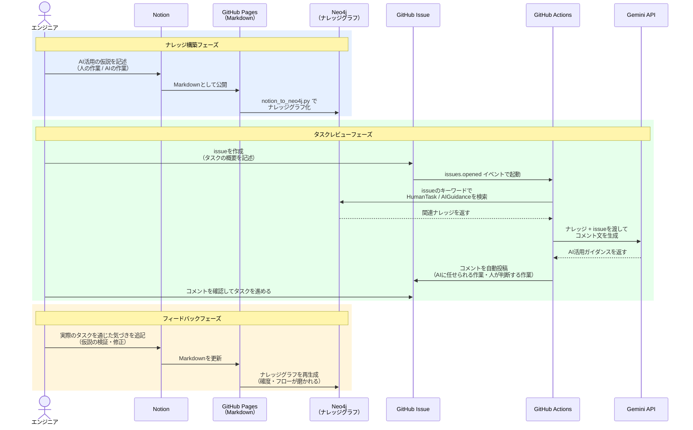

# saiteki-doc

エンジニアが「この作業はAIに任せられる」と定義した仮説をナレッジに蓄積し、タスク作成時にAIがそのナレッジをもとにコメントします。取りこぼしなくAI活用できているかを、タスクのレビューのような形でチームに届けます。

フィードバックをナレッジに追加していくことで、AIに任せられる作業の確度とフローが継続的に磨かれていくことを狙っています。

---

## システムフロー



---

## 現在のナレッジベース

| フェーズ | ナレッジページ |
|---|---|
| テスト | テスト観点抽出・テスト設計書作成・テスト戦略 |
| 追加予定 | 要件定義・設計・実装 |

---

## 使い方

### issueを作成してAIレビューをもらう

[新しいissueを作成する](../../issues/new) だけで、30〜60秒後にAI活用ガイダンスのコメントが自動で届きます。

### ナレッジを追加・更新する

1. Notionにページを追加・編集する
2. GitHub Pagesに公開されたMarkdownを確認する
3. `scripts/notion_to_neo4j.py` の `PAGE_IDS` に追加するページIDを記載してスクリプトを実行する

```bash
export NOTION_TOKEN="your-notion-token"
export NEO4J_PASSWORD="your-neo4j-password"
python3 scripts/notion_to_neo4j.py
```

---

## GitHub Secrets の設定

リポジトリの **Settings → Secrets and variables → Actions** に以下を登録してください。

| シークレット名 | 内容 |
|---|---|
| `GEMINI_API_KEY` | Google Gemini APIキー |
| `NEO4J_PASSWORD` | Neo4j Auraのパスワード |

---

## ファイル構成

```
.github/workflows/ai_guidance.yml    # issueトリガーワークフロー
scripts/generate_ai_guidance.py      # コメント生成スクリプト
scripts/notion_to_neo4j.py           # ナレッジグラフ生成スクリプト
```
