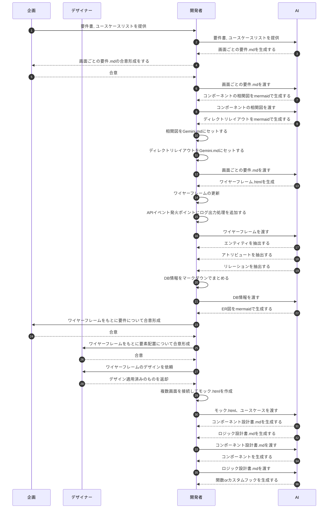

# HTMLモック早期生成

本セクションでは、要件定義から実装に入る前に「動くHTMLモック」を作成し、早期に合意形成を図るプロセスについて解説します。

## 概要

開発の手戻りを防ぐ最大のポイントは、「作ったものが想像と違う」というズレを最初になくすことです。
AIを活用することで、紙の仕様書ではなく、実際のブラウザで動作する `mock.html` を短時間で作成し、ステークホルダー（企画、デザイナー、エンジニア）全員が同じイメージを持ってから開発をスタートします。

## 運用する資料

### 1. mock.html
*   **目的**: 要件・デザインの整合性を確認するための「動く仕様書」。
*   **内容**: 画面遷移、ボタンクリック時の挙動、バリデーション、ログ出力イメージなどをHTML/JSで表現したもの。
*   **生成方法**:
    *   **インプット**: 要件定義書、またはユースケースリスト。
    *   **プロセス**: AIにプロンプトを与えて初期コードを生成。
    *   **リファインメント**: StagewiseやAntigravityなどのツールを使用し、画面を見ながらプロンプトで微修正を行う。

### 2. Gemini.md
*   **目的**: AIにプロジェクトの文脈（コンテキスト）を記憶させ、回答精度を高めるためのファイル。
*   **内容**:
    *   **コンポーネント間の依存関係図**
    *   **最新のディレクトリ構成図**
*   **運用**: ファイル追加や構成変更があるたびに、この足を更新してAIに最新状態を認識させます。

## ワークフロー

### Step 1: 要件整理
ユーザーの要望やユースケースを箇条書きにし、AIに渡して `requirement.md`（要件定義書）のドラフトを作成させます。
関係者でレビューし、ここでの認識齟齬をなくします。

### Step 2: 可視化
現状のシステム構成がある場合、AIに `Gemini.md` を更新させ、どこに何を追加すべきかを可視化します。

### Step 3: プロトタイプ生成
確定した要件を元に、AIに `wireframe.html` または初期の `mock.html` を生成させます。
この段階ではデザインよりも「画面遷移」や「必要な要素」が揃っているかを確認します。

### Step 4: 洗練
生成されたモックをブラウザで確認し、Stagewise等のツールを使ってブラッシュアップします。
*   「ここのボタンは右寄せにして」
*   「クリックしたら確認ダイアログを出して」
*   「エラー時は赤文字でメッセージを出して」
といった指示を出し、完成形の `mock.html` に仕上げます。

### Step 5: 実装へ
`mock.html` の承認が取れたら、それを「正」の仕様として、実際のコンポーネント実装（React/Vue等）に進みます。
詳しくは次項の「API・データモデルの先行生成」を参照してください。

## 全体フロー (AI活用イメージ図)

以下は、企画・開発・デザイナー・AIがどのように連携してHTMLモックを作成・活用するかを示したシーケンス図です。

