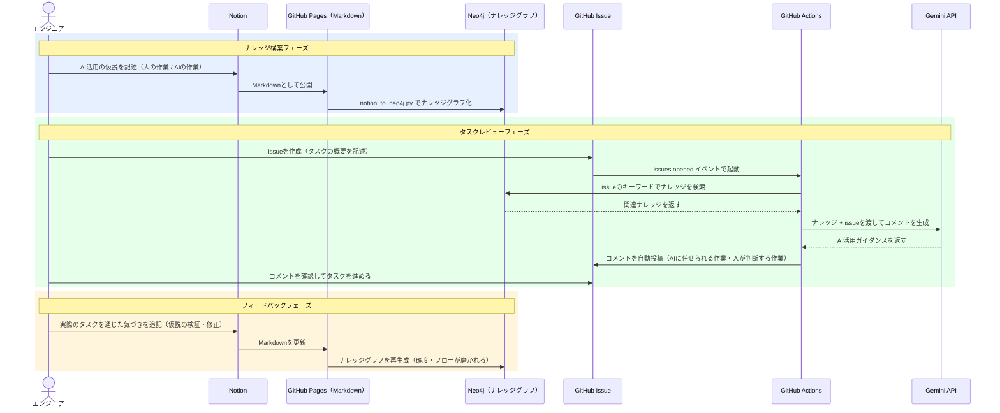

# AIタスクレビューシステム

## 背景

エンジニアがissueを作成してタスクを始める際、「このタスクでAI活用できたのに、後から気づいた」という取りこぼしは珍しくありません。また、AI活用の仮説がメンバーの頭の中にとどまりチームで共有されていないことも多く、せっかくの知見が次のタスクに活かされていない状態が続いています。

こうした課題に対し、**「Notionに蓄積したAI活用の仮説をナレッジグラフ化し、issueが作成されるたびにAIが自動でレビューコメントを届けるシステム」** を構築しました。

## システムの概要

Notion・GitHub Pages・Neo4j・GitHub Actionsを連携させた3フェーズのパイプラインです。

### フェーズ1: ナレッジ構築

エンジニアがNotionに「人がやること」「AIにやってほしいこと」を記述します。`notion_to_markdown.py` でMarkdownに変換してGitHub Pagesに公開し、`notion_to_neo4j.py` でNeo4jのナレッジグラフとして蓄積します。

### フェーズ2: タスクレビュー

issueを作成すると GitHub Actions が自動起動し、issueのキーワードでNeo4jを検索、関連するナレッジをGemini APIに渡してAI活用ガイダンスのコメントを生成・投稿します。エンジニアはコメントを確認し取りこぼしなくAIを活用できます。

### フェーズ3: フィードバック

実際のタスクを経て得た気づきをNotionに追記します。再度Markdownとグラフを更新することで、次のissueからより精度の高いコメントが届くようになります。フィードバックを重ねるほどシステムが賢くなる設計です。

## 導入のメリット

1. **AI活用の取りこぼし防止**: issueを作るだけで自動的にAI活用の観点が届くため、気づきの機会を逃さない。
2. **ナレッジの組織共有**: 個人の頭の中にあった仮説がシステムに蓄積され、チーム全体で活用できる資産になる。
3. **継続的な精度向上**: フィードバックサイクルを回すことで、AI活用できる作業の確度とフローが継続的に磨かれる。
4. **ゼロオペレーション**: issue作成以外に特別な操作は不要。ナレッジ更新も既存のNotion→push運用に乗る。

## まとめ

このシステムは、エンジニアが定義した「AIに任せられる作業の仮説」を資産化し、タスクのたびにレビューとして届ける仕組みです。使うほどナレッジが蓄積され、AIコメントの精度が上がり、チーム全体のAI活用力が高まる──そのサイクルを自動化することが、このシステムの本質的な価値です。
