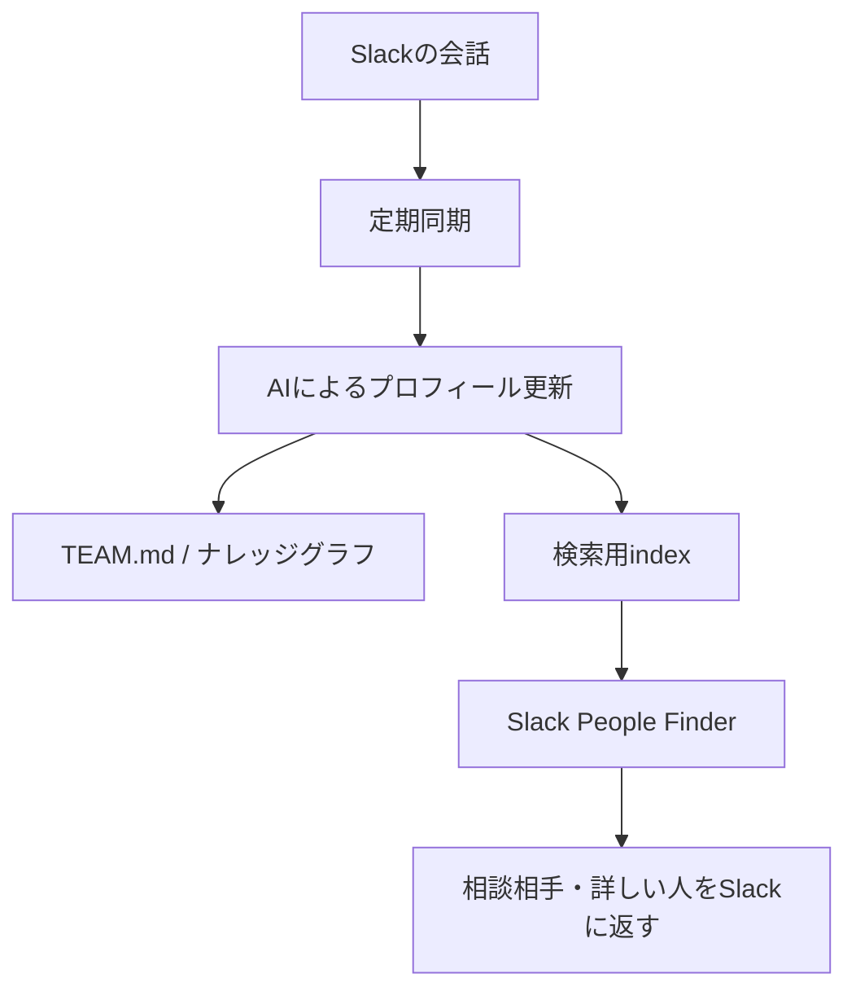

# 社員情報管理AIの活用

## 背景

リモートワークや非同期コミュニケーションが中心となる現代の組織では、次のような課題が生じがちです。

- **メンバーの状態が見えにくい**: 日々の業務連絡だけでは、モチベーションの変化や悩み、潜在的な強みに気づきにくい。
- **相談相手を探しにくい**: 「このテーマに詳しい人」「この経験がある人」を、Slackの記憶や人づてだけで探してしまう。
- **ナレッジの入口が分散する**: TEAM.md、ナレッジグラフ、Slackログがあっても、日常業務の中で参照されなければ活用されない。
- **評価への誤用リスク**: AI分析を人事評価の代替として扱うと、本人の文脈や変化を見落とす。

こうした課題に対し、**日々のSlackコミュニケーションから社員プロフィールと関係性データを更新し、Slack上で相談相手を探せる状態にする** ために [saiteki-employee-management](https://github.com/Saitekiinc-com/saiteki-employee-management) を運用します。

## 現在の位置づけ

この取り組みは、単なる「社員情報の管理」ではなく、組織内の知識と人の接点をSlackから引き出す仕組みです。

- **定期分析**: Slackの発言ログを収集し、社員プロフィール、強み、関心、関係性を更新する。
- **可視化**: TEAM.md、ナレッジグラフ、文化指標などを生成し、組織理解の土台にする。
- **Slack検索**: `/saiteki-people` から「誰に聞くとよいか」「同じ関心を持つ人は誰か」を探せる。
- **根拠の提示**: プロフィールだけでなく、Slackメッセージ由来の根拠も参照できるようにする。

## システムの概要

Slack上の発言データを定期的に収集し、Google Geminiを用いて分析します。分析結果は社員プロフィール図鑑やナレッジグラフとして残し、さらにSlackから検索できる形へ発展させます。

## 導入のメリット

### ① 隠れた「強み」や「人柄」の発見

人間が全チャットを追うことは難しいですが、AIは業務連絡の端々にある「気遣い」「論理的な思考」「チームを和ませる発言」を拾い上げ、その人の強みやチーム内での役割を可視化できます。

### ② 「Saitekiらしさ」に基づいた客観的評価

一般的な「優秀さ」ではなく、Saitekiのカルチャーに合っているかという独自基準で分析します。ただし、この結果は評価の結論ではなく、1on1やチーム設計の仮説として扱います。

### ③ 相談相手探しの高速化

「AWS運用に詳しい人」「ポケモンが好きな人」「採用広報を相談できる人」のような自然文をSlackで投げると、関連する社員候補を返せます。検索結果は会話のきっかけであり、本人への確認を前提にします。

### ④ オンボーディングとチームビルディングへの活用

新しく入社したメンバーの価値観やコミュニケーションスタイルを早期に把握し、個人に合ったオンボーディング計画を作成できます。メンバー同士の補完関係を理解することで、チーム編成やメンター選定にも使えます。

## 配下の実践ページ

- [Slackから行う社員プロファイル検索](./employee_profile_search)

このページでは、Slack検索の利用シーンに加えて、`employees.json`、Slackメッセージログ、プロフィールグラフ、embedding付き検索index、Geminiによる再ランキングまでのデータ構造と検索フローを記載します。

## 運用ガイドライン

- AI分析は、人を評価しきるためではなく、対話や相談の入口を増やすために使う。
- Slack検索の結果は、候補者本人への確認とセットで扱う。
- 古いプロフィールや誤った推測が見つかった場合は、最新の運用に合わせてデータと説明を上書きする。
- 新しい使い方が増えた場合は、このページの配下に実践ページを追加する。
- 個人の機微情報を広げすぎず、Slackで検索者本人だけに返すなど、表示範囲を絞る。

## まとめ

「社員情報管理AI」は、メンバー一人ひとりの個性を最大限に活かすための支援ツールです。今後は、分析結果を読むだけでなく、Slackから必要な人にたどり着けるプロファイル検索ツールとして運用します。
