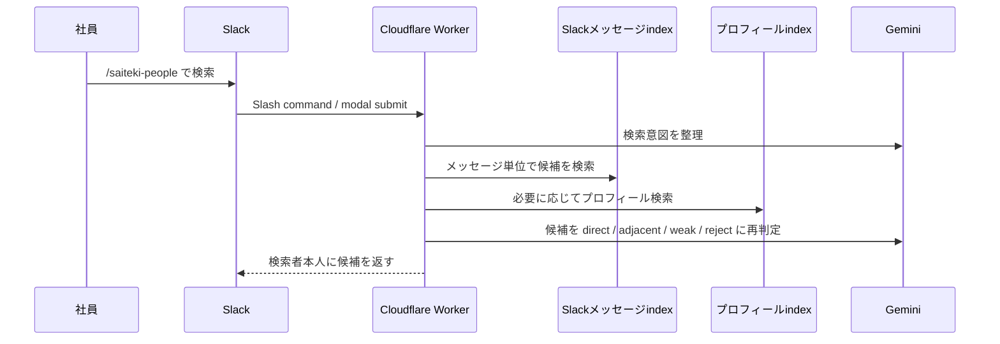

# Slackから行う社員プロファイル検索

## 背景

社員プロフィールやナレッジグラフは、作るだけでは十分に使われません。業務中に「この件を誰に相談すればよいか」と思った瞬間に、普段使っているSlackから探せることが重要です。

[saiteki-employee-management](https://github.com/Saitekiinc-com/saiteki-employee-management) では、Slack同期で作られた社員プロフィールと検索用indexを使い、Slack App `Saiteki People Finder` として人を探せる形に発展させます。

## 何ができるか

Slackで `/saiteki-people` を実行し、自然文で探したい人を入力します。

例:

- `AWS運用の経験がある人`
- `採用広報を相談できる人`
- `ポケモンが好きな人`
- `新規事業の壁打ち相手になりそうな人`

検索結果は、候補者の名前、該当しそうな理由、根拠となるプロフィール情報やSlackメッセージの文脈を添えて返します。結果は検索者本人だけに表示するメッセージを基本にします。

## システムの概要

## データの流れ

1. Slackの会話ログを定期同期する。
2. AIが社員ごとの強み、関心、価値観、現在の状態を更新する。
3. `TEAM.md`、ナレッジグラフ、検索用indexを生成する。
4. Cloudflare WorkerがSlackからの検索リクエストを受ける。
5. メッセージindexとプロフィールindexを使って候補を集める。
6. Geminiで質問意図に合う候補だけを再ランキングする。
7. Slackに、相談のきっかけとして使える短い回答を返す。

## 検索の考え方

### 実発言を優先する

プロフィールに整理済みの強みだけでなく、Slackメッセージ単位のindexを検索します。これにより、まだプロフィールに反映されていない話題や具体的な経験も拾いやすくなります。

### 候補をそのまま信じない

ベクトル検索で近い候補を出したあと、AIが質問意図に対して `direct`、`adjacent`、`weak`、`reject` を判定します。経験者検索では、単なる勉強会案内や引用だけの人を直接候補にしないようにします。

### 会話の入口として使う

検索結果は「この人に決める」ためのものではなく、「この人に聞いてみるとよさそう」という会話の入口です。実際の経験、現在の稼働、相談可否は本人に確認します。

## 利用シーン

- 新しいテーマで相談相手を探す。
- オンボーディング中の社員に、話しかけやすい相手を紹介する。
- 顧客課題に近い経験を持つ社員を探す。
- 趣味や関心をきっかけに、Slack上のコミュニケーションを増やす。
- チーム編成やメンター候補の仮説を作る。

## 運用上の注意

- AIの分析結果は評価の結論にしない。
- 検索結果に違和感がある場合は、プロフィールや検索indexを更新する。
- センシティブな内容や本人が広げたくない情報は、検索対象や表示内容から外す。
- Slackメッセージ由来の根拠は、必要最小限の引用やリンクに留める。
- 検索できる範囲と対象チャンネルは、運用責任者が定期的に見直す。

## 発展方針

社員プロファイル検索は、社員情報管理AIを日常業務に接続する最初の入口です。今後は、検索ログや利用者のフィードバックをもとに、オンボーディング、メンター推薦、チーム編成、社内ナレッジ探索へ広げます。
