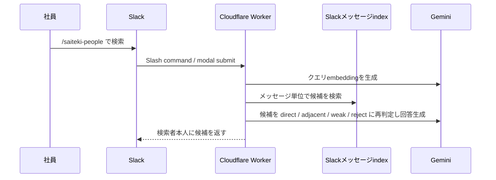
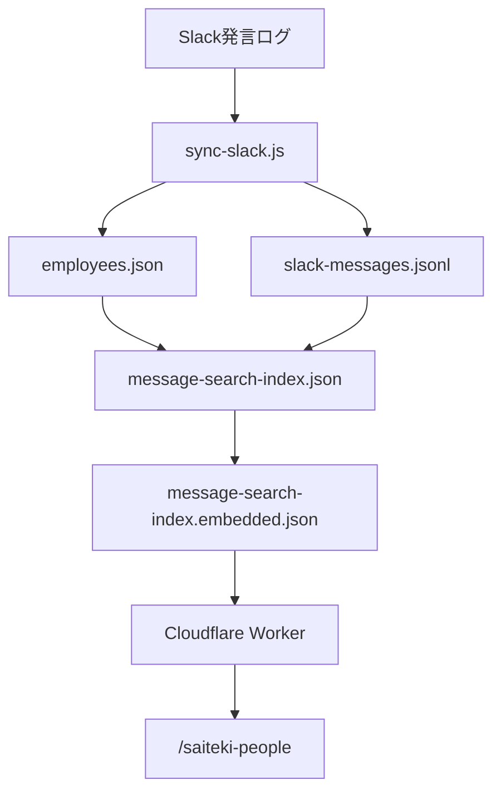

# Slackから行う社員プロファイル検索

## 背景

社員プロフィールやナレッジグラフは、作るだけでは十分に使われません。業務中に「この件を誰に相談すればよいか」と思った瞬間に、普段使っているSlackから探せることが重要です。

[saiteki-employee-management](https://github.com/Saitekiinc-com/saiteki-employee-management) では、Slack同期で作られた社員プロフィールと検索用indexを使い、Slack App `Saiteki People Finder` として人を探せる形に発展させます。

## 何ができるか

Slackで `/saiteki-people` を実行し、自然文で探したい人を入力します。

例:

- `AWS運用の経験がある人`
- `採用広報を相談できる人`
- `ポケモンが好きな人`
- `新規事業の壁打ち相手になりそうな人`

検索結果は、候補者の名前、該当しそうな理由、根拠となるSlackメッセージの文脈を添えて返します。結果は検索者本人だけに表示するメッセージを基本にします。

このページでは、Slackコマンドの使い方だけでなく、AI検索を成立させるためにどのようなデータを用意し、どのような構造でindex化し、どのような検索方式で社員候補を返すかを整理します。

## 用意するデータ

`saiteki-employee-management` では、Slack検索のために次のデータを用意します。

| データ | 役割 |
| --- | --- |
| `data/employees.json` | 社員ごとの基本プロフィール。名前、職種、Slack ID、AIが整理した強み、価値観、最近の状態などを持つ。 |
| `data/slack-messages.jsonl` | Slack同期で取得した発言ログ。メッセージID、投稿者、チャンネル、本文、時刻などを1行1 JSONで保持する。 |
| `data/message-search-index.json` | Slackメッセージ本文を検索単位にしたindex。現行のSlack検索で主に使う。 |
| `data/message-search-index.embedded.json` | `message-search-index.json` の各検索単位にembeddingベクトルを付与したもの。現行のSlack検索ではこちらを検索対象にする。 |

ポイントは、**社員プロフィールでSlack IDと職種を整理し、検索対象そのものはSlack上の実発言に寄せる** ことです。現行の `/saiteki-people` は、メッセージ検索indexを検索します。

## データ構造

### 社員プロフィール

`employees.json` は、社員ごとの構造化プロフィールです。AIがSlackの発言から更新する対象であり、検索だけでなくTEAM.mdやナレッジグラフの元にもなります。

```json
{
  "name": "社員名",
  "job": "職種・役割",
  "slack_id": "SlackユーザーID",
  "overall_summary": "全体像の要約",
  "personality_traits": {},
  "work_styles_and_strengths": {
    "dominant_strengths": [],
    "problem_solving_style": ""
  },
  "communication_patterns": {},
  "values_and_motivators": {
    "core_values": [],
    "motivation_triggers": []
  },
  "current_state": {
    "recent_topics_of_interest": []
  }
}
```

ここでは、本人を固定的に評価するためではなく、相談相手探しやオンボーディングの材料にしやすい形で、強み、関心、価値観、最近の話題を分けて持ちます。

### メッセージ検索index

`message-search-index.json` は、Slackメッセージを検索単位にします。現在のSlack検索では、このメッセージindexを使います。

```json
{
  "@type": "saiteki:MessageSearchUnit",
  "person": "person:社員名",
  "personName": "社員名",
  "slackIds": ["SlackユーザーID"],
  "message": "message:workspace:channel:timestamp",
  "semanticType": "slack_message",
  "category": "message",
  "sourceLabel": "Slackメッセージ",
  "relationLabel": "Slack発言: チャンネル名",
  "topicLabel": "チャンネル名",
  "timestamp": "投稿日時",
  "detailBullets": ["発言本文の要約または抜粋"],
  "quotes": [],
  "searchText": "発言本文、チャンネル名、職種など"
}
```

このindexは、本人が実際に話していた内容を探すためのものです。経験者検索では、プロフィール上の自己申告や要約ではなく、具体的な発言が候補発見の入口になります。

主な項目の意味は次の通りです。

| 項目 | 意味 |
| --- | --- |
| `person` / `personName` | 発言者に対応する社員。Slack IDと社員プロフィールを突き合わせて決める。 |
| `relationLabel` | 検索結果で「どの根拠か」を短く示すラベル。メッセージ検索では `Slack発言: チャンネル名` のように入る。 |
| `topicLabel` | 検索単位の主題。メッセージ検索では投稿されたチャンネル名を入れ、検索語との語彙一致にも使う。 |
| `detailBullets` | Slack本文の要約または抜粋。検索結果で根拠として見せる材料になる。 |
| `quotes` | 元メッセージへの参照。チャンネル、投稿時刻、本文などを保持し、Slack Exportページへの確認導線に使う。 |
| `searchText` | embeddingの入力にする本文。Slack本文、チャンネル名、職種などをまとめ、意味検索の対象にする。 |

役割としては、`searchText` はベクトル検索の入力、`relationLabel` と `topicLabel` は短い検索語の語彙補正、`detailBullets` と `quotes` は根拠表示に使います。検索単位に `topicAliases` がある場合は、別表記や略称として語彙補正に使えます。現行のメッセージ検索indexでは、基本的に `relationLabel` と `topicLabel` が語彙補正の対象です。

`message-search-index.embedded.json` では、各メッセージ検索単位に次のようなembedding情報を追加します。

```json
{
  "embedding": {
    "provider": "gemini",
    "model": "gemini-embedding-001",
    "textHash": "searchTextのハッシュ",
    "dimensions": 768,
    "vector": [0.01, -0.02]
  }
}
```

`textHash` を持たせることで、検索テキストが変わっていない単位は前回のembeddingを再利用できます。

## システムの概要



## データの流れ



1. Slackの会話ログを定期同期する。
2. AIが社員ごとの強み、関心、価値観、現在の状態を `employees.json` に更新する。
3. Slackメッセージログと社員プロフィールのSlack IDを突き合わせ、`message-search-index.json` を生成する。
4. Gemini embeddingで `searchText` をベクトル化し、`message-search-index.embedded.json` を生成する。
5. Cloudflare WorkerがGitHub raw URLなどからembedding済みメッセージindexを取得し、Slackからの検索に使う。

GitHub Actionsでは、Slack同期後にメッセージ検索index、embedding付きindex、Slack Exportページを生成します。Workerはローカルファイルを読めないため、生成済みの `message-search-index.embedded.json` をURLで取得できる状態にしておきます。

## 検索フロー

`/saiteki-people` が実行された後は、次の流れで候補を返します。

1. Slackのslash commandまたはmodal送信をCloudflare Workerで受ける。
2. Slack署名を検証し、検索文字列を取り出す。
3. 入力クエリをGemini embeddingの `RETRIEVAL_QUERY` としてベクトル化する。
4. `message-search-index.embedded.json` の各メッセージ単位とのコサイン類似度を計算する。
5. ラベルや別表記の語彙一致を小さく加点し、候補検索単位を集める。
6. 検索単位を社員ごとに集約し、上位の根拠とSlack発言を候補に付ける。
7. Geminiで候補を `direct` / `adjacent` / `weak` / `reject` に再判定する。
8. `direct` と、設定次第で `adjacent` の候補だけをSlackに返す。

再判定では、「AWS経験者」と「AWSの記事を共有した人」を区別します。特に経験者検索では、勉強会案内、記事共有、関心表明だけを `direct` にしないことが重要です。

## 検索の考え方

### 実発言を優先する

Slackメッセージ単位のindexを検索します。これにより、プロフィールに反映済みかどうかに関係なく、実際の発言に基づいて話題や具体的な経験を拾いやすくなります。

通常の検索では、`message-search-index.embedded.json` を先に見ます。これは「プロフィールに何と書かれているか」より先に、「本人がSlackで何を話していたか」を見るためです。人を探す場面では、実発言に基づく根拠がある方が会話につなげやすくなります。

### ベクトル検索と語彙補正を組み合わせる

検索の中心はembeddingベクトルのコサイン類似度です。クエリと検索単位の `searchText` を同じ次元のベクトルにし、意味的に近い単位を探します。

一方で、社員検索では「AWS」「React」「QA」「ポケモン」のような短い固有語が重要になることがあります。そのため、完全な意味検索だけにせず、検索語が `relationLabel` や `topicLabel` に含まれる場合は小さく加点します。検索単位に `topicAliases` がある場合は、別表記や略称も同じ補正対象にできます。

### 候補をそのまま信じない

ベクトル検索で近い候補を出したあと、AIが質問意図に対して `direct`、`adjacent`、`weak`、`reject` を判定します。経験者検索では、単なる勉強会案内や引用だけの人を直接候補にしないようにします。

この再判定では、候補に含まれる根拠だけを使います。根拠にない推測で「詳しそう」と補わないこと、Slackメッセージ検索では実発言や具体メモを必須の根拠にすることをルール化します。

### 回答生成は検索結果の要約に限定する

最終的なSlack返信では、候補者名だけでなく、なぜ候補なのかを短く説明します。ただし、回答生成AIは新しい評価を作るのではなく、検索で得た根拠を読みやすく要約する役割に限定します。

### 会話の入口として使う

検索結果は「この人に決める」ためのものではなく、「この人に聞いてみるとよさそう」という会話の入口です。実際の経験、現在の稼働、相談可否は本人に確認します。

## 運用設定の要点

Slack検索を動かすには、Worker側で次の設定を持ちます。

| 設定 | 役割 |
| --- | --- |
| `MESSAGE_SEARCH_INDEX_URL` | embedding済みメッセージindexの取得先。通常検索で最優先する。 |
| `GEMINI_API_KEY` | クエリembedding、再ランキング、回答生成に使う。Worker secretとして扱う。 |
| `GEMINI_EMBEDDING_MODEL` | 既定では `gemini-embedding-001`。 |
| `GEMINI_RERANK_MODEL` | 候補の再判定や回答生成に使うモデル。 |
| `MESSAGE_VIEWER_URL` | 根拠Slackメッセージを確認するためのSlack ExportページURL。 |

embedding済みindexを使う場合は、index生成時のモデルとクエリembedding時のモデル、次元数を揃えます。現在の実装では、メッセージindexをGemini embeddingの768次元で扱う前提です。

## 利用シーン

- 新しいテーマで相談相手を探す。
- オンボーディング中の社員に、話しかけやすい相手を紹介する。
- 顧客課題に近い経験を持つ社員を探す。
- 趣味や関心をきっかけに、Slack上のコミュニケーションを増やす。
- チーム編成やメンター候補の仮説を作る。

## 運用上の注意

- AIの分析結果は評価の結論にしない。
- 検索結果に違和感がある場合は、Slackメッセージ同期や検索indexを更新する。
- センシティブな内容や本人が広げたくない情報は、検索対象や表示内容から外す。
- Slackメッセージ由来の根拠は、必要最小限の引用やリンクに留める。
- 検索できる範囲と対象チャンネルは、運用責任者が定期的に見直す。
- ベクトル検索が正常に動いて0件だった場合は、無理に別方式で候補を捏造しない。
- `direct` 判定であっても、本人の現在の担当範囲や相談可否は別途確認する。

## 発展方針

社員プロファイル検索は、社員情報管理AIを日常業務に接続する最初の入口です。今後は、検索ログや利用者のフィードバックをもとに、オンボーディング、メンター推薦、チーム編成、社内ナレッジ探索へ広げます。
