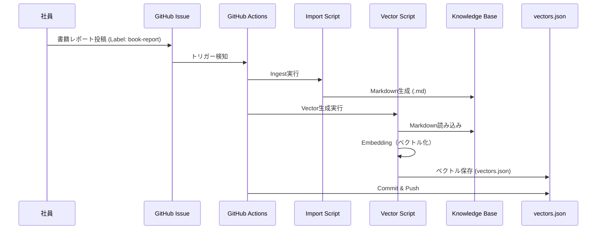
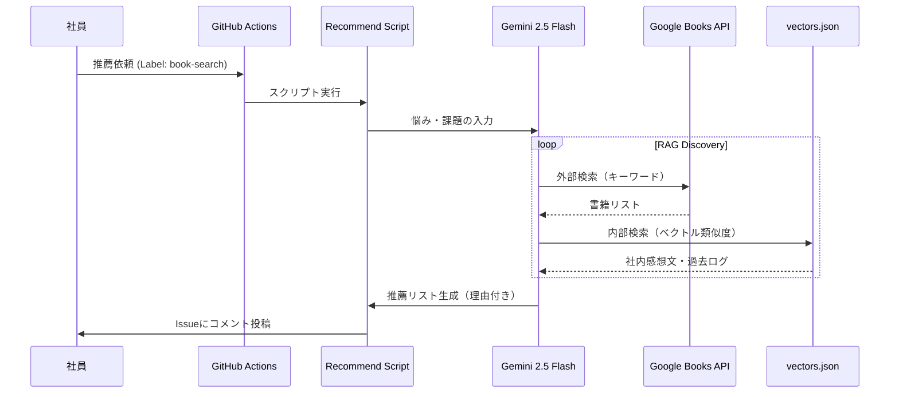

# 読書サイクルとRAG活用

## 背景

エンジニアの学習において、以下のような課題が頻繁に発生します。

- **選書の難しさ**: 「今の自分のレベルや課題感に合った本がわからない」
- **知見の孤立化**: せっかく良書を読んでも、感想や学びが個人の頭の中に留まりチームに共有されない
- **検索性の低さ**: 過去に誰かが読んだはずの本でも、チャットログに埋もれて必要なときに参照できない

これらを解決するために、**「書籍レポートのナレッジベース化」** と **「AIによる文脈検索・推薦」** を組み合わせた仕組みを、研修用リポジトリ [saiteki-study-doc](https://github.com/Saitekiinc-com/saiteki-study-doc) に導入しています。

## システムの概要

GitHub Issues をインターフェースとし、GitHub Actions と Gemini API を連携させて動作します。

### 書籍レポートのナレッジ化フロー

エンジニアがIssueに書籍レポートを投稿するだけで、後のプロセスがすべて自動化されます。

```mermaid
sequenceDiagram
    participant User as 社員
    participant Issue as GitHub Issue
    participant Action as GitHub Actions
    participant Ingest as Import Script
    participant Vector as Vector Script
    participant KB as Knowledge Base
    participant JSON as vectors.json

    User->>Issue: 書籍レポート投稿 (Label: book-report)
    Issue->>Action: トリガー検知
    Action->>Ingest: Ingest実行
    Ingest->>KB: Markdown生成 (.md)
    Action->>Vector: Vector生成実行
    Vector->>KB: Markdown読み込み
    Vector->>Vector: Embedding（ベクトル化）
    Vector->>JSON: ベクトル保存 (vectors.json)
    Action->>JSON: Commit & Push
```

### 書籍推薦・逆引き検索フロー

「今の自分におすすめの本は？」と質問すると、RAGを用いて最適な提案を行います。

```mermaid
sequenceDiagram
    participant User as 社員
    participant Action as GitHub Actions
    participant Script as Recommend Script
    participant AI as Gemini 2.5 Flash
    participant GBooks as Google Books API
    participant JSON as vectors.json

    User->>Action: 推薦依頼 (Label: book-search)
    Action->>Script: スクリプト実行
    Script->>AI: 悩み・課題の入力
    loop RAG Discovery
        AI->>GBooks: 外部検索（キーワード）
        GBooks-->>AI: 書籍リスト
        AI->>JSON: 内部検索（ベクトル類似度）
        JSON-->>AI: 社内感想文・過去ログ
    end
    AI->>Script: 推薦リスト生成（理由付き）
    Script->>User: Issueにコメント投稿
```

## 導入のメリット

1. **文脈による検索**: 単なるキーワード一致ではなく「こういうときどうすればいい？」という課題感に対して、意味的に近い書籍を検索できる。
2. **社内ナレッジの活用**: Amazonレビューではなく「社内の先輩がその本を読んでどう感じたか」という内部コンテキストをAIが引き出して推薦理由に含める。
3. **完全自動化**: IssueにレポートをWriteするだけで、保存・ベクトル化・インデックス更新がすべてGitHub Actionsで自動実行される。

## まとめ

読書サイクルとRAGの組み合わせは、個人の学びをチームの資産に変える仕組みです。エンジニアが本を読むたびに組織のナレッジベースが成長し、次に誰かが悩んだときの道しるべになります。継続することで、チーム全体の学習効率と知識の再利用性が高まります。
