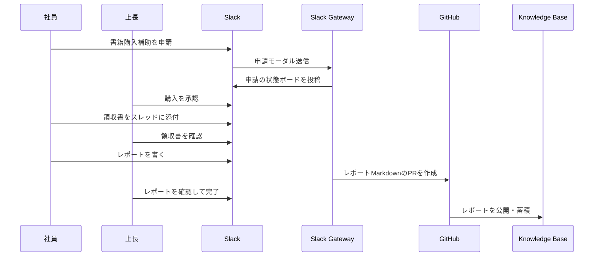
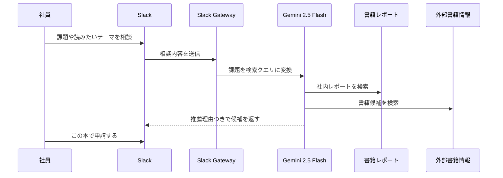

# 読書サイクルとRAG活用

## 背景

エンジニアの学習では、「何を読むか」「読んだ内容をどう共有するか」「後からどう再利用するか」が分断されやすくなります。

- **選書の難しさ**: 今の課題感に合う本が分からない。
- **知見の孤立化**: 読後の気づきが個人の頭の中に残り、チームの資産になりにくい。
- **入力の重さ**: GitHub Issue や Pull Request を前提にすると、制度利用の心理的なハードルが上がる。
- **検索性の低さ**: 過去の読書レポートが増えても、必要な場面で取り出せなければ活用されない。

そのため、現在の読書サイクルは **Slackで完結する書籍購入補助フロー** を入口にし、GitHubは読書レポートをナレッジベースとして保存・公開する裏側の仕組みに寄せています。

## 現在の位置づけ

利用者と上長が触る主な画面はSlackです。

- 利用者はSlackの申請ボタン、スレッド、モーダルで申請・領収書提出・レポート提出を行う。
- 上長はSlack投稿上のボタンで購入承認、領収書確認、レポート確認を行う。
- GitHubは、読了後のレポートをMarkdownとして保存し、後続のRAG・推薦・検索に使うための管理場所として扱う。

この仕組みは [saiteki-study-doc](https://github.com/Saitekiinc-com/saiteki-study-doc) の書籍購入補助として運用します。

## システムの概要

書籍購入補助チャンネルのSlack投稿を、1冊ごとの状態ボードとして扱います。

```mermaid
sequenceDiagram
    participant User as 社員
    participant Manager as 上長
    participant Slack as Slack
    participant Worker as Slack Gateway
    participant GitHub as GitHub
    participant KB as Knowledge Base

    User->>Slack: 書籍購入補助を申請
    Slack->>Worker: 申請モーダル送信
    Worker->>Slack: 申請の状態ボードを投稿
    Manager->>Slack: 購入を承認
    User->>Slack: 領収書をスレッドに添付
    Manager->>Slack: 領収書を確認
    User->>Slack: レポートを書く
    Worker->>GitHub: レポートMarkdownのPRを作成
    Manager->>Slack: レポートを確認して完了
    GitHub->>KB: レポートを公開・蓄積
```

## 利用者の体験

利用者は、次の流れだけを理解していれば制度を使えます。

1. Slackで `書籍購入補助を申請する` を押す。
2. 承認後に本を購入し、領収書を申請スレッドへ貼る。
3. 読了後に `レポートを書く` から学びを入力する。
4. 上長確認が終わると、申請が完了する。

GitHub Issue、ラベル、Pull Request、Markdown保存は利用者に見せる主導線にしません。制度利用の入口をSlackに寄せることで、読後データを継続的に集めやすくします。

## AI活用のポイント

読書サイクルでAIが担う価値は、単なるレポート保存ではなく、学びを次の行動に再利用できる状態にすることです。

### 1. 読後メモを組織ナレッジに変換する

Slackから提出されたレポートは、GitHub上のMarkdownとして蓄積します。これにより、個人の感想を社内で検索・参照できる形に変えます。

### 2. 選書相談へ戻す

蓄積したレポートは、将来的に「今の課題に合う本は何か」「過去に似た悩みで読まれた本は何か」を答えるRAGの材料にします。

### 3. 組織課題を観測する

どの本が読まれているか、どんな目的で申請されているかを見ることで、チームが抱えている課題や関心領域を把握できます。

## RAG活用の発展形

読書レポートが十分に蓄積されたら、Slack上で選書相談までつなげます。

```mermaid
sequenceDiagram
    participant User as 社員
    participant Slack as Slack
    participant Worker as Slack Gateway
    participant AI as Gemini 2.5 Flash
    participant Reports as 書籍レポート
    participant Books as 外部書籍情報

    User->>Slack: 課題や読みたいテーマを相談
    Slack->>Worker: 相談内容を送信
    Worker->>AI: 課題を検索クエリに変換
    AI->>Reports: 社内レポートを検索
    AI->>Books: 書籍候補を検索
    AI-->>Slack: 推薦理由つきで候補を返す
    User->>Slack: この本で申請する
```

## 運用ガイドライン

- 古くなった説明は、現在の運用に合わせて上書きする。
- 利用者向けの説明では、Slack上の実操作を先に書く。
- GitHubやCloudflare Workersは、必要な場合だけ裏側の仕組みとして説明する。
- 新しいAI活用が増えた場合は、既存ページへ無理に詰め込まず、該当ページの配下に追加する。
- レポートの品質を高くしすぎる前に、複数人が小さく継続して投稿できる状態を優先する。

## 導入のメリット

1. **入力ハードルの低下**: 申請、承認、領収書、レポート提出をSlackに集約できる。
2. **社内ナレッジの蓄積**: 読後の学びをMarkdownとして残し、後から検索・推薦に使える。
3. **文脈による推薦**: 単なる書名検索ではなく、課題感に近い社内レポートや書籍候補を返せる。
4. **組織課題の可視化**: 読書目的の傾向から、チームが今必要としている知識領域を把握できる。

## まとめ

読書サイクルは、Slackで自然に制度を使いながら、読後の学びを組織のナレッジへ変える仕組みです。GitHubは利用者に操作させる入口ではなく、レポートを長期的に保存し、RAGや推薦に使うための基盤として位置づけます。
