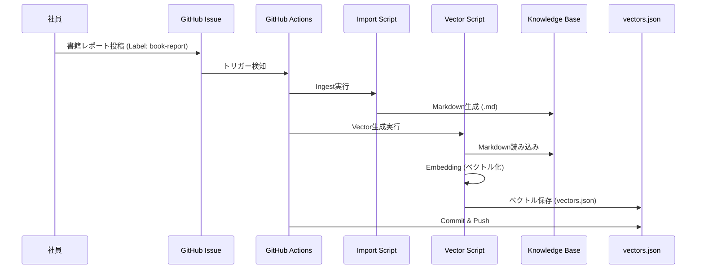
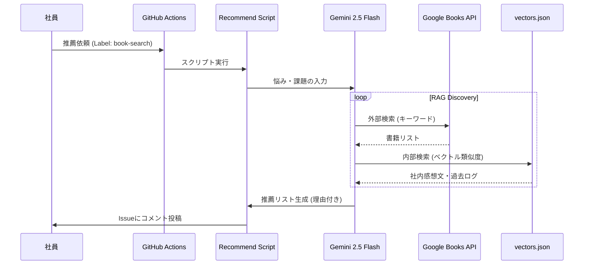

# 読書サイクルとRAG活用

## 概要

Saitekiのエンジニア研修では、単に技術書を読むだけでなく、その学びをチーム全体の資産として循環させる **「読書サイクル」** を重視しています。
これを支援するために、研修用リポジトリ ([saiteki-study-doc](https://github.com/Saitekiinc-com/saiteki-study-doc)) には **RAG (Retrieval-Augmented Generation)** 技術を活用したナレッジ共有システムが導入されています。

## 背景

エンジニアの学習において、以下のような課題が頻繁に発生します。

1.  **選書の難しさ**: 「今の自分のレベルや課題感に合った本がわからない」。
2.  **知見の孤立化**: せっかく良書を読んでも、その感想や学びが個人の頭の中に留まり、チームに共有されない。
3.  **検索性の低さ**: 過去に誰かが読んだはずの本でも、チャットログなどに埋もれてしまい、必要な時に参照できない。

これらを解決するために、**「書籍レポートのナレッジベース化」** と **「AIによる文脈検索・推薦」** を組み合わせた仕組みを構築しました。

## 活用メリット

このシステムを活用することで、以下のメリットが得られます。

### 1. 文脈による検索
単なるキーワード一致ではなく、**「こういう時にどうすればいい？」** という悩みや課題感（Context）に対して、関連する書籍を検索できます。
ベクトル検索技術により、言葉の揺らぎを吸収し、意味的に近い情報を提示します。

### 2. 社内ナレッジの活用
一般的な書籍レビュー（Amazonなど）だけでなく、**「社内の先輩がその本を読んでどう感じたか」** という内部のコンテキストを重視します。
「このプロジェクトではこの章が役に立った」といった実践的な知見をAIが引き出し、推薦理由に含めてくれます。

### 3. 完全自動化
エンジニアは GitHub Issue に書籍レポートを書くだけです。
後のプロセス（保存、ベクトル化、検索インデックス更新）はすべて **GitHub Actions** によって自動的に行われるため、ドキュメント管理の手間がかかりません。

## システムアーキテクチャ

本システムは Github Issues をインターフェースとし、GitHub Actions と Gemini API を連携させて動作しています。

### 1. 書籍レポートのナレッジ化フロー

レポートが投稿されると、自動的にMarkdownとして保存され、ベクトルデータとして蓄積されます。

### 2. 書籍推薦 & 逆引き検索フロー

「今の自分におすすめの本は？」と質問すると、RAGを用いて最適な提案を行います。

